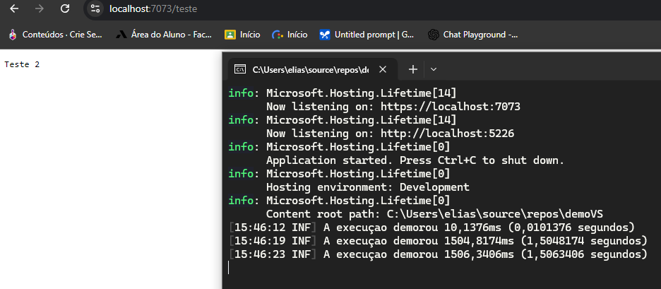

# Iniciando Com AspNetCore
Este repositório contém um projeto criado a partir de um curso da plataforma desenvolvedor.io, 
focado em ASP.NET Core. O objetivo deste projeto é apresentar uma introdução completa ao 
framework ASP.NET, desde sua configuração inicial até o entendimento do que acontece "por baixo dos panos" 
durante o ciclo de vida de uma aplicação.

## Ambiente Visual Studio Community:
- Com double-click em demoVS em "Solution Explorer" você ve as informações de versões, pacotes utilizados e 
configurações de seu projeto.

- Program.cs seria o codigo inicial executado de seu projeto.

- Em properties launchsettings.json seria as configurações de dominio http(s) de seu projeto.

## Pacotes Nuget
- Em search(lupa) no visual studio code e pesquisar por Package Manager Console sera o terminal para fazer 
instalações de pacote(NuGet)

- Clicando com o botão direto do mouse em demoVS em "Solution Explorer" e "manage NuGet Packages" sera possível 
adicionar as bibliotecas. 

- Para ver mais bibliotecas basta acessar o site: https://www.nuget.org/packages/ 

- E terminal Package Manager Console insera o comando de instalação por exemplo: 
	```bash
	Install-Package Serilog.AspNetCore -Version 8.0.2

## Middlewares
O que é um Middleware?

- Middlewares são componentes de software em uma aplicação ASP.NET. Estes componentes manipulam dados entre 
os requests e responses.

- Um middleware possui uma responsabilidade definida e pode trabalhar lado a lado com outros middlewares. 
Quando falamos do pipeline do ASP.NET estamos falando basicamente de Middlewares.

- No programa meuMiddleWare.cs vera um exemplo prático.

### Executar HTTPS
- Para poder executar o projeto com https(uma versão segura do HTTP) sera necessário seguir os seguintes passos:
    
1. Saber se possui um certificado valido para utilizar nos comando http:
    ```bash
    dotnet dev-certs https --check
    
2. Fazer uma limpeza no certificado:
    ```bash
    dotnet dev-certs https --clean


3. Criar um novo certificado:
    ```bash
    dotnet dev-certs https

4. Confirmar que o novo certificado é confiável:
    ```bash
    dotnet dev-certs https --trust

## Execução



